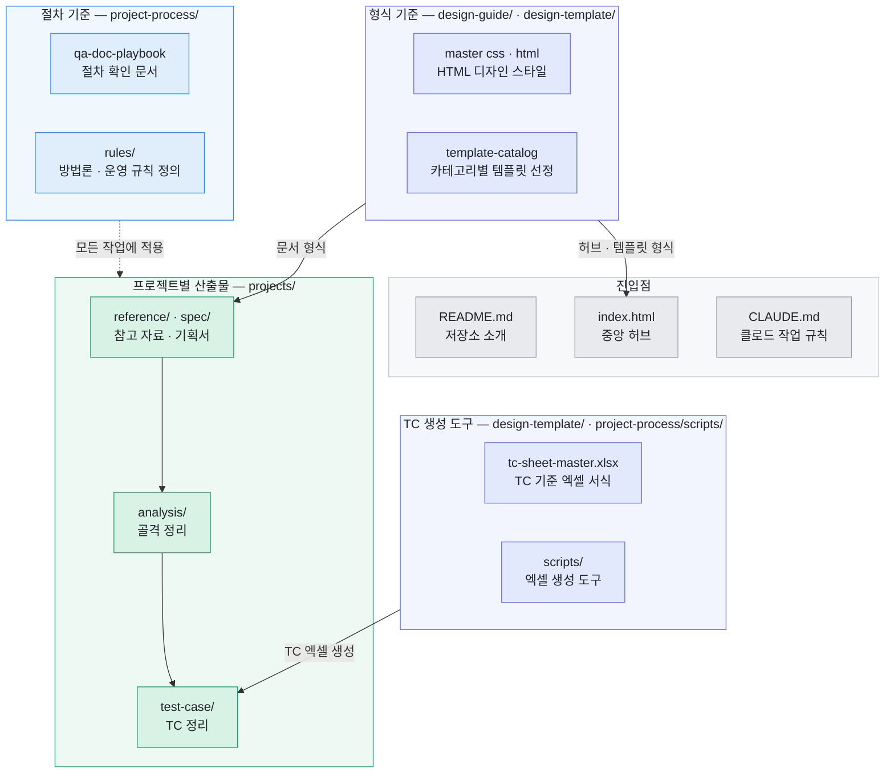

# QA-VisualNovel-Portfolio

출시된 서비스와 기획서를 QA 관점에서 분석해 **기능 골격(Depth 트리) → 테스트 케이스(xlsx)**까지
산출하는 QA 포트폴리오 워크스페이스입니다.

한 번 만들고 끝나는 산출물이 아니라, 기능이 바뀔 때마다 골격을 갱신하고 그 이력을 추적하는
**살아있는 자산**으로 운영합니다. 이 저장소의 구조 자체가 그 운영 방식을 보여주도록 설계했습니다.

## 구조

관계는 세 종류로 묶여 있습니다. **절차 기준**(`qa-doc-playbook`·`rules/`)은 특정 산출물이 아니라
모든 작업 전에 확인하는 규칙이고, **형식 기준**(`master css·html`·`template-catalog`)은 중앙 허브부터
프로젝트 문서까지 모든 HTML 산출물의 형식을 결정하며, **TC 생성 도구**(`tc-sheet-master.xlsx`·`scripts/`)는
TC 엑셀 하나를 만들어 냅니다. 마지막 묶음은 폴더 위치가 서로 다르지만 역할이 한 쌍이라 함께 묶었습니다.

| 폴더 | 역할 |
|---|---|
| `project-process/` | 모든 작업이 따르는 절차·규칙. 파이프라인 절차서(`qa-doc-playbook.md`), 중앙 용어집 색인(`qa-dictionary.md`), 방법론·운영 규칙 정의(`rules/`), xlsx 생성 도구(`scripts/`) |
| `design-guide/` | 디자인 일관성의 기준 — 스타일 정본 CSS + 시각 규칙서 HTML |
| `design-template/` | 문서 포맷 템플릿(`NN-{템플릿명}.html`)과 판별 기준(`template-catalog.md`), TC 시트 기준 서식(`tc-sheet-master.xlsx`) |
| `projects/{프로젝트}/` | 프로젝트별 산출물 — 허브·용어집·변경 이력·참고 자료(`reference/`)·기획서(`spec/`)·기능 골격(`analysis/`)·TC(`test-case/`) |

## 워크플로우

1. **분석** — 대상(출시 서비스 또는 기획서)을 수집·분해합니다. 미확인 값은 추측으로 채우지 않고 `?`로 남깁니다.
2. **골격** — 기능을 Depth 계층으로 정규화한 기능 트리를 세우고, 노드마다 검증유형(결정적·확률적·루브릭·금칙)을 판정합니다.
3. **TC** — 골격이 확정되면 노드를 정상·경계·예외·우회로 전개해 실행용 TC 시트(xlsx)로 산출합니다.

## 왜 이렇게 설계했나

**단일 정본, 나머지는 파생.** 기능 골격은 `analysis/{프로젝트}-feature-tree.md` 한 파일만 손으로
고칩니다. 트리 시각화 HTML과 TC xlsx는 전부 정본에서 재생성됩니다. 골격이 세 곳에 따로 살면
수정 누락으로 반드시 어긋나기 때문입니다.

**change-log 이원화.** 문서 이력(`{프로젝트}-change-log.md`)은 작업 전 항상 읽는 파일,
골격 이력(`analysis/{프로젝트}-analysis-change-log.md`)은 평소에 열지 않는 파일로 분리했습니다.
삭제·수정된 옛 기능 정보가 현재 작업에 섞여 들어오는 것을 막기 위해서입니다 — 참조 규칙이
정반대인 두 기록을 한 파일에 두면 격리가 불가능합니다.

**archive/ 동결 스냅샷.** TC 시트에는 "기준 골격 v1.0"이 기록되는데 정본은 계속 진화합니다.
과거 TC를 검토하거나 롤백을 판단할 때 그 시점 골격 전체를 파일 하나로 대조할 수 있도록,
큰 개정 직전의 정본을 통째로 동결해 둡니다.

**TC 시트 규칙의 이중화.** 시트 작성 규칙은 md 문서(`rules/tc-sheet-format.md`)와 기준 xlsx의
'명세서' 시트 양쪽에 두고 교차 검증합니다. 한 곳에서만 관리하다 잘못 수정되면 설계 전체가
틀어지는 것을 막는 안전장치입니다.

**이슈 관리 시트 내장.** 실무 정석은 JIRA 같은 트래커 분리 운영이지만, 이 저장소는 포트폴리오
열람 편의를 위해 TC와 이슈 흐름을 한 파일에서 볼 수 있도록 xlsx 안에 이슈 관리 시트를 내장했습니다.

**용어집 이원화.** 범용 QA 용어(중앙, `qa-dictionary.md`)와 프로젝트 고유명사(프로젝트별
`{프로젝트}-dictionary.html`)를 분리했습니다. 중앙 용어집은 정의를 새로 쓰지 않는 색인이라
정의 중복과 어긋남이 원천 차단됩니다.

**골격 재사용, 시드 파일 없음.** 새 프로젝트는 기존 프로젝트 골격에서 필요한 부분만 복사해
시작하고, 복사된 순간부터 완전히 독립됩니다. 공유 파일이 없으니 프로젝트 간 오염이 없습니다.

**디자인은 승인 갱신만.** 문서가 늘어도 디자인이 일관되도록, 새 디자인 요소는 템플릿
카탈로그의 판별 절차(Case A/B/C)를 거쳐 마스터를 버전 갱신하는 방식으로만 추가됩니다.

## 방법론 핵심

- **검증유형이 기능 목록보다 먼저.** LLM이 응답을 만드는 서비스는 "기대 결과가 단일하다"는
  TC의 전제가 깨지므로, 결정적/확률적/루브릭/금칙 네 갈래로 먼저 나눕니다.
- **TN은 케이스 안의 스텝 번호.** 케이스 사이의 선행 관계는 별개 층위(TC 관계도)로 다룹니다.
- **상태는 Depth가 아니라 Pre-Condition으로.** 로그인·구독·플랫폼을 계층으로 쪼개면 트리가
  폭발합니다.
- **추측으로 기대값을 채우지 않는다.** 미확인 값은 `?`로 남기고 실측으로만 확정합니다.

자세한 규칙은 [`project-process/qa-doc-playbook.md`](project-process/qa-doc-playbook.md)와
[`project-process/rules/`](project-process/rules/)에서 시작하세요.
